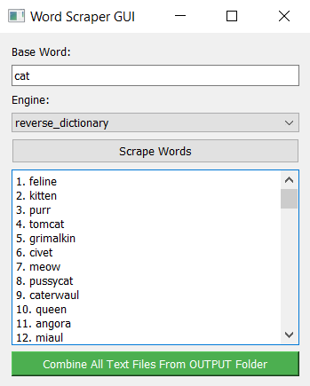
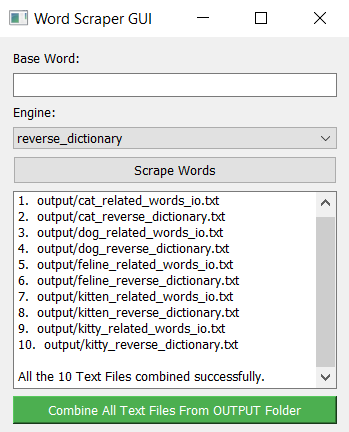

# Word Scraper

Word Scraper is a Python application built with PyQt5 that allows users to scrape related words to a base word using two different engines, and combine them into a single text file without duplicates.


## Features

- **Dual Engine Scraping**: Choose between two scraping engines (`reverse_dictionary` and `related_words_io`) to fetch related words.
- **Output Handling**: Each set of scraped words is saved in the "output" folder with a filename format `{base_word}_{engine}.txt`.
- **Duplicate Removal**: Combine all scraped files into one `final_list.txt` file in the main directory, ensuring no duplicate words.
- **User-friendly GUI**: Interactive GUI built with PyQt5 for easy navigation and operation.

## Screenshots

|  |  |  |
|------------------------------|--------------------------------|--------------------------------------|
| **Basic GUI Look**           | **Fetching Data**              | **Combine Functionality**            |
| Shows the basic appearance of the GUI. | Demonstrates fetching and displaying data. | Illustrates the "Combine All Text Files" button. |


## Installation

1. **Clone the Repository:**
   ```bash
   git clone https://github.com/Nafi7393/Word-Scraper.git
   cd Word-Scraper
   ```

2. **Install Dependencies:**
   ```bash
   pip install -r requirements.txt
   ```

## Usage

1. **Run the Application:**
   ```bash
   python app.py
   ```

2. **Scrape Words:**
   - Enter a base word in the "Base Word" field.
   - Select an engine (`reverse_dictionary` or `related_words_io`).
   - Click "Scrape Words" to initiate scraping.

   **Example**: Enter "cat" as the base word. Choose both engines (`reverse_dictionary` and `related_words_io`). Click "Scrape Words" to fetch related words to "cat".
####
3. **Combine Text Files:**
   - After scraping multiple words, click "Combine All Text Files From OUTPUT Folder".
   - The combined result will be saved as `final_list.txt` in the main directory.

   **Example**: After scraping "cat", "kitty", "kitten", and "feline" using both engines, click "Combine All Text Files From OUTPUT Folder". This will merge `cat_reverse_dictionary.txt`, `cat_related_words_io.txt`, `kitty_reverse_dictionary.txt`, `kitty_related_words_io.txt`, etc., into `final_list.txt` without duplicate words.

## Contributing

Contributions are welcome! Please fork the repository and submit pull requests.

#